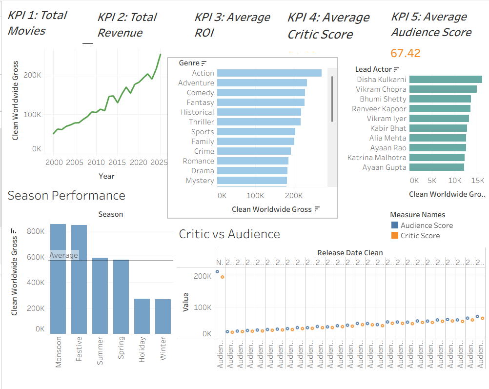

## Box Office Analysis (Tableau Dashboard)

## Project Overview

This project analyzes box office data to uncover trends in movie performance, revenue generation, and audience preferences using interactive Tableau dashboards.

## Objective

To visualize key patterns in box office data and provide insights that can support decision-making in the film industry.

## Dashboard Highlights
Revenue trends across different movies
Comparison of genres and performance
Identification of high-performing films

## Key Insights

1) **Revenue Growth Trend:**
  Box office revenue shows a consistent upward trend over the years, indicating strong industry growth and increasing audience engagement.

2) **Top Performing Genres:**
  Action and Adventure genres generate the highest worldwide gross, making them the most commercially successful categories.

3) **Seasonal Impact:**
  Movies released during **Monsoon and Festive seasons** achieve the highest average revenue, suggesting strong seasonal influence on box office performance.

5) **Actor Influence:**
  Certain lead actors consistently contribute to higher box office earnings, indicating star power plays a significant role in revenue generation.

6) **Audience vs Critic Scores:**
  Audience scores are generally higher and show a steady pattern compared to critic scores, suggesting audience reception may be more positive or consistent than critical reviews.

7) **Moderate Correlation Between Scores:**
  There is no strong visible correlation between critic scores and audience scores, implying that critical acclaim does not always translate into audience approval.

8) **ROI vs Revenue Insight:**
  High revenue does not always imply high ROI, indicating that production costs and efficiency significantly impact profitability.

## Dashboard Preview

## Business Recommendations
1) Focus on producing Action and Adventure films to maximize revenue potential
2) Strategically release films during Festive and Monsoon seasons
3) Leverage popular lead actors for higher box office success
4) Consider audience preferences alongside critic reviews for better decision-making
5) Optimize production budgets to improve ROI, not just revenue

📁 Project Files
Tableau Workbook: box_office_analysis.twbx

🚀 Tools & Technologies
Tableau
